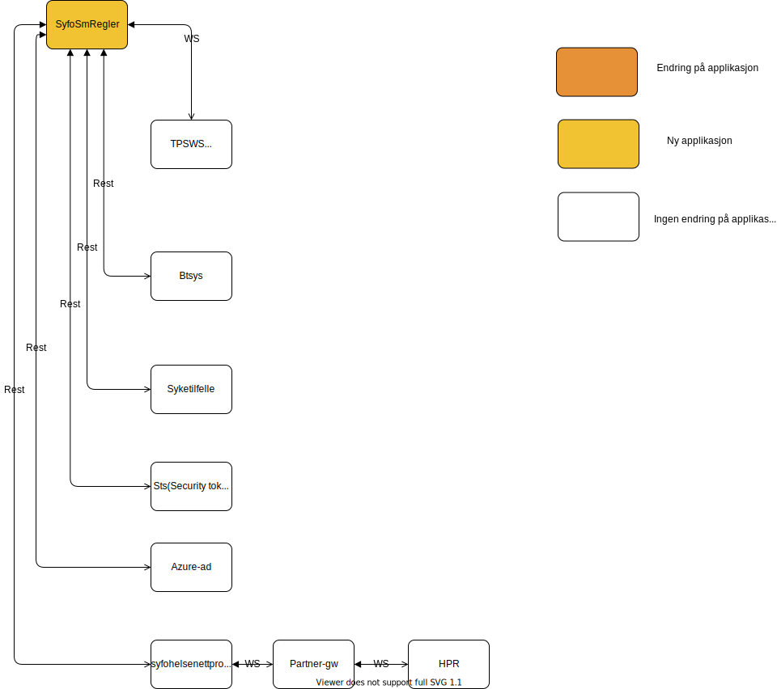

[](https://github.com/navikt/syfosmregler/workflows/Deploy%20to%20dev%20and%20prod/badge.svg)

# SYFO sykemelding regler
This project contains just the rules for validating whether or not a user is supposed to get paid sick leave



# Technologies used
* Kotlin
* Ktor
* Gradle
* Spek
* Jackson

#### Requirements

* JDK 17

## Getting started
### Getting github-package-registry packages NAV-IT
Some packages used in this repo is uploaded to the Github Package Registry which requires authentication. It can, for example, be solved like this in Gradle:
```
val githubUser: String by project
val githubPassword: String by project
repositories {
    maven {
        credentials {
            username = githubUser
            password = githubPassword
        }
        setUrl("https://maven.pkg.github.com/navikt/syfosm")
    }
}
```

`githubUser` and `githubPassword` can be put into a separate file `~/.gradle/gradle.properties` with the following content:

```                                                     
githubUser=x-access-token
githubPassword=[token]
```

Replace `[token]` with a personal access token with scope `read:packages`.

Alternatively, the variables can be configured via environment variables:

* `ORG_GRADLE_PROJECT_githubUser`
* `ORG_GRADLE_PROJECT_githubPassword`

or the command line:

```
./gradlew -PgithubUser=x-access-token -PgithubPassword=[token]
```
#### Running locally
`./gradlew run`

### Building the application
#### Compile and package application
To build locally and run the integration tests you can simply run `./gradlew shadowJar` or on windows 
`gradlew.bat shadowJar`

#### Creating a docker image
Creating a docker image should be as simple as `docker build -t syfosmregler .`

#### Running a docker image
`docker run --rm -it -p 8080:8080 syfosmregler`

### Importing flowchart from gliffy confluence
1. Open a web browser and go the confluence site that has the gliffy diagram you want to import, example site:
https://confluence.adeo.no/display/KES/SyfoSmMottak.
2. Click on the gliffy diagram and the "Edit Digram" buttom
3. Then go to File -> Export... and choose the Gliffy File Format (The gliffy diagram, should now be downloaded to you computer)
4. Open a web browser and go to: https://app.diagrams.net/
5. Choose the "Open Existing Diagram", then choose the file that was downloaded from step 3.
6. Click on File -> Save (The diagram is now saved as a drawio format, store it in the source code)
7. Click on File -> Export as SVG...(The diagram is now saved as SVG, store it in the source code)
8. Commit and push the changes so its up to date

### Editing existing flowchart
1. Open a web browser and go to: https://app.diagrams.net/
2. Choose the "Open Existing Diagram", then choose the file /src/flowchart/flyttdiagram.drawio
3. Do the changes you want, and the save it as a drawio, back to /src/flowchart/flyttdiagram.drawio
4. Click on File -> Export as SVG... save the file to here: file here: /src/svg/flytdiagram.svg
5. Commit and push the changes so its up to date

### Creating a new flowchart
1. Open a web browser and go to: https://app.diagrams.net/
2. Choose the "Create New diagram",
3. Do the changes you want, and the save it as a drawio, back to /src/flowchart/flyttdiagram.drawio
4. Click on File -> Export as SVG... save the file to here: file here: /src/svg/flytdiagram.svg
5. Commit and push the changes so its up to date

### Upgrading the gradle wrapper
Find the newest version of gradle here: https://gradle.org/releases/ Then run this command:

```./gradlew wrapper --gradle-version $gradleVersjon```

### Inquiries
Questions related to the code or the project can be asked as issues here on GitHub

### For NAV employees
We are available at the Slack channel #team-sykmelding