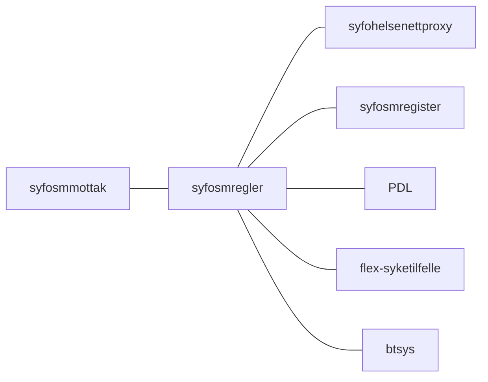
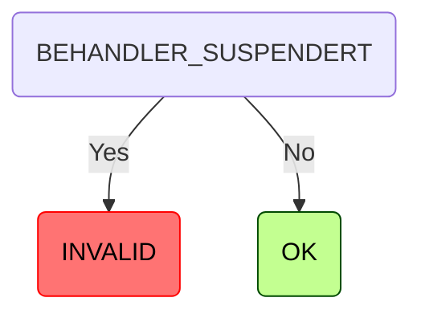
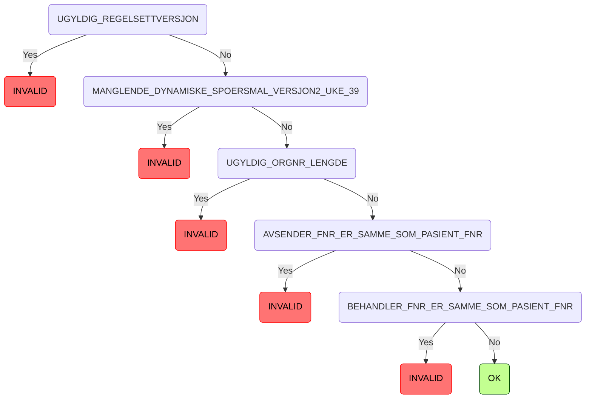
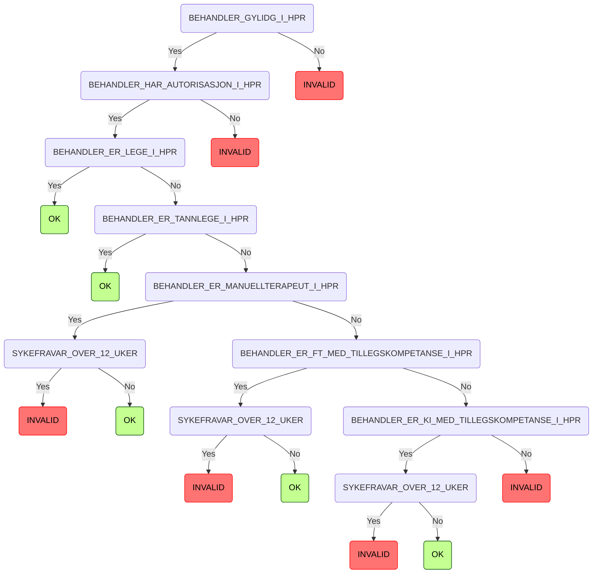
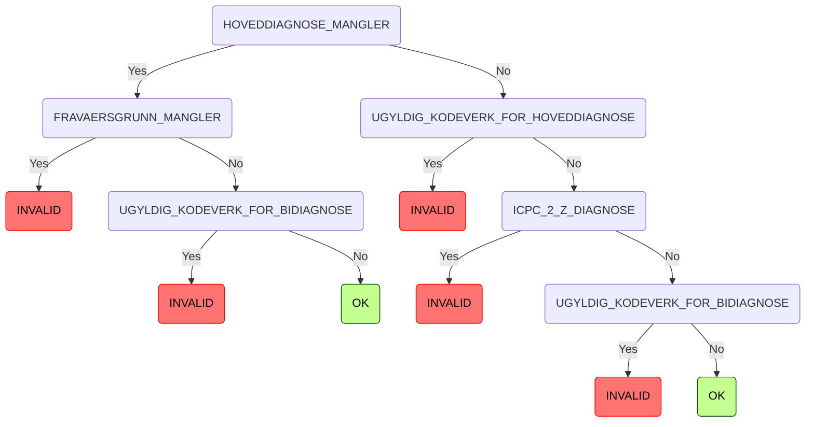
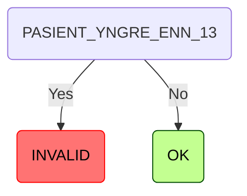
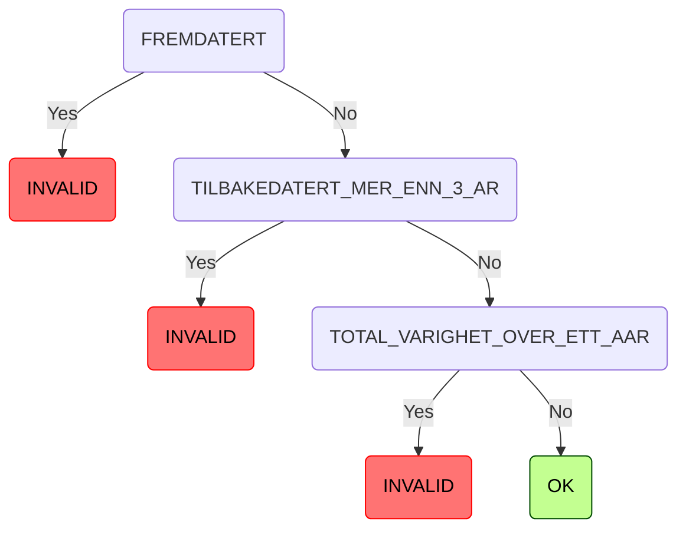

```mermaid
graph TD
    root(TILBAKEDATERING) -->|Yes| root_TILBAKEDATERING_ETTERSENDING(ETTERSENDING)
    root_TILBAKEDATERING_ETTERSENDING(ETTERSENDING) -->|Yes| root_TILBAKEDATERING_ETTERSENDING_OK(OK):::ok
    root_TILBAKEDATERING_ETTERSENDING(ETTERSENDING) -->|No| root_TILBAKEDATERING_ETTERSENDING_TILBAKEDATERT_INNTIL_4_DAGER(TILBAKEDATERT_INNTIL_4_DAGER)
    root_TILBAKEDATERING_ETTERSENDING_TILBAKEDATERT_INNTIL_4_DAGER(TILBAKEDATERT_INNTIL_4_DAGER) -->|Yes| root_TILBAKEDATERING_ETTERSENDING_TILBAKEDATERT_INNTIL_4_DAGER_OK(OK):::ok
    root_TILBAKEDATERING_ETTERSENDING_TILBAKEDATERT_INNTIL_4_DAGER(TILBAKEDATERT_INNTIL_4_DAGER) -->|No| root_TILBAKEDATERING_ETTERSENDING_TILBAKEDATERT_INNTIL_4_DAGER_TILBAKEDATERT_INNTIL_8_DAGER(TILBAKEDATERT_INNTIL_8_DAGER)
    root_TILBAKEDATERING_ETTERSENDING_TILBAKEDATERT_INNTIL_4_DAGER_TILBAKEDATERT_INNTIL_8_DAGER(TILBAKEDATERT_INNTIL_8_DAGER) -->|Yes| root_TILBAKEDATERING_ETTERSENDING_TILBAKEDATERT_INNTIL_4_DAGER_TILBAKEDATERT_INNTIL_8_DAGER_BEGRUNNELSE_MIN_1_ORD(BEGRUNNELSE_MIN_1_ORD)
    root_TILBAKEDATERING_ETTERSENDING_TILBAKEDATERT_INNTIL_4_DAGER_TILBAKEDATERT_INNTIL_8_DAGER_BEGRUNNELSE_MIN_1_ORD(BEGRUNNELSE_MIN_1_ORD) -->|Yes| root_TILBAKEDATERING_ETTERSENDING_TILBAKEDATERT_INNTIL_4_DAGER_TILBAKEDATERT_INNTIL_8_DAGER_BEGRUNNELSE_MIN_1_ORD_OK(OK):::ok
    root_TILBAKEDATERING_ETTERSENDING_TILBAKEDATERT_INNTIL_4_DAGER_TILBAKEDATERT_INNTIL_8_DAGER_BEGRUNNELSE_MIN_1_ORD(BEGRUNNELSE_MIN_1_ORD) -->|No| root_TILBAKEDATERING_ETTERSENDING_TILBAKEDATERT_INNTIL_4_DAGER_TILBAKEDATERT_INNTIL_8_DAGER_BEGRUNNELSE_MIN_1_ORD_FORLENGELSE(FORLENGELSE)
    root_TILBAKEDATERING_ETTERSENDING_TILBAKEDATERT_INNTIL_4_DAGER_TILBAKEDATERT_INNTIL_8_DAGER_BEGRUNNELSE_MIN_1_ORD_FORLENGELSE(FORLENGELSE) -->|Yes| root_TILBAKEDATERING_ETTERSENDING_TILBAKEDATERT_INNTIL_4_DAGER_TILBAKEDATERT_INNTIL_8_DAGER_BEGRUNNELSE_MIN_1_ORD_FORLENGELSE_OK(OK):::ok
    root_TILBAKEDATERING_ETTERSENDING_TILBAKEDATERT_INNTIL_4_DAGER_TILBAKEDATERT_INNTIL_8_DAGER_BEGRUNNELSE_MIN_1_ORD_FORLENGELSE(FORLENGELSE) -->|No| root_TILBAKEDATERING_ETTERSENDING_TILBAKEDATERT_INNTIL_4_DAGER_TILBAKEDATERT_INNTIL_8_DAGER_BEGRUNNELSE_MIN_1_ORD_FORLENGELSE_SPESIALISTHELSETJENESTEN(SPESIALISTHELSETJENESTEN)
    root_TILBAKEDATERING_ETTERSENDING_TILBAKEDATERT_INNTIL_4_DAGER_TILBAKEDATERT_INNTIL_8_DAGER_BEGRUNNELSE_MIN_1_ORD_FORLENGELSE_SPESIALISTHELSETJENESTEN(SPESIALISTHELSETJENESTEN) -->|Yes| root_TILBAKEDATERING_ETTERSENDING_TILBAKEDATERT_INNTIL_4_DAGER_TILBAKEDATERT_INNTIL_8_DAGER_BEGRUNNELSE_MIN_1_ORD_FORLENGELSE_SPESIALISTHELSETJENESTEN_OK(OK):::ok
    root_TILBAKEDATERING_ETTERSENDING_TILBAKEDATERT_INNTIL_4_DAGER_TILBAKEDATERT_INNTIL_8_DAGER_BEGRUNNELSE_MIN_1_ORD_FORLENGELSE_SPESIALISTHELSETJENESTEN(SPESIALISTHELSETJENESTEN) -->|No| root_TILBAKEDATERING_ETTERSENDING_TILBAKEDATERT_INNTIL_4_DAGER_TILBAKEDATERT_INNTIL_8_DAGER_BEGRUNNELSE_MIN_1_ORD_FORLENGELSE_SPESIALISTHELSETJENESTEN_INVALID(INVALID):::invalid
    root_TILBAKEDATERING_ETTERSENDING_TILBAKEDATERT_INNTIL_4_DAGER_TILBAKEDATERT_INNTIL_8_DAGER(TILBAKEDATERT_INNTIL_8_DAGER) -->|No| root_TILBAKEDATERING_ETTERSENDING_TILBAKEDATERT_INNTIL_4_DAGER_TILBAKEDATERT_INNTIL_8_DAGER_TILBAKEDATERT_INNTIL_1_MAANED(TILBAKEDATERT_INNTIL_1_MAANED)
    root_TILBAKEDATERING_ETTERSENDING_TILBAKEDATERT_INNTIL_4_DAGER_TILBAKEDATERT_INNTIL_8_DAGER_TILBAKEDATERT_INNTIL_1_MAANED(TILBAKEDATERT_INNTIL_1_MAANED) -->|Yes| root_TILBAKEDATERING_ETTERSENDING_TILBAKEDATERT_INNTIL_4_DAGER_TILBAKEDATERT_INNTIL_8_DAGER_TILBAKEDATERT_INNTIL_1_MAANED_BEGRUNNELSE_MIN_1_ORD(BEGRUNNELSE_MIN_1_ORD)
    root_TILBAKEDATERING_ETTERSENDING_TILBAKEDATERT_INNTIL_4_DAGER_TILBAKEDATERT_INNTIL_8_DAGER_TILBAKEDATERT_INNTIL_1_MAANED_BEGRUNNELSE_MIN_1_ORD(BEGRUNNELSE_MIN_1_ORD) -->|Yes| root_TILBAKEDATERING_ETTERSENDING_TILBAKEDATERT_INNTIL_4_DAGER_TILBAKEDATERT_INNTIL_8_DAGER_TILBAKEDATERT_INNTIL_1_MAANED_BEGRUNNELSE_MIN_1_ORD_FORLENGELSE(FORLENGELSE)
    root_TILBAKEDATERING_ETTERSENDING_TILBAKEDATERT_INNTIL_4_DAGER_TILBAKEDATERT_INNTIL_8_DAGER_TILBAKEDATERT_INNTIL_1_MAANED_BEGRUNNELSE_MIN_1_ORD_FORLENGELSE(FORLENGELSE) -->|Yes| root_TILBAKEDATERING_ETTERSENDING_TILBAKEDATERT_INNTIL_4_DAGER_TILBAKEDATERT_INNTIL_8_DAGER_TILBAKEDATERT_INNTIL_1_MAANED_BEGRUNNELSE_MIN_1_ORD_FORLENGELSE_OK(OK):::ok
    root_TILBAKEDATERING_ETTERSENDING_TILBAKEDATERT_INNTIL_4_DAGER_TILBAKEDATERT_INNTIL_8_DAGER_TILBAKEDATERT_INNTIL_1_MAANED_BEGRUNNELSE_MIN_1_ORD_FORLENGELSE(FORLENGELSE) -->|No| root_TILBAKEDATERING_ETTERSENDING_TILBAKEDATERT_INNTIL_4_DAGER_TILBAKEDATERT_INNTIL_8_DAGER_TILBAKEDATERT_INNTIL_1_MAANED_BEGRUNNELSE_MIN_1_ORD_FORLENGELSE_ARBEIDSGIVERPERIODE(ARBEIDSGIVERPERIODE)
    root_TILBAKEDATERING_ETTERSENDING_TILBAKEDATERT_INNTIL_4_DAGER_TILBAKEDATERT_INNTIL_8_DAGER_TILBAKEDATERT_INNTIL_1_MAANED_BEGRUNNELSE_MIN_1_ORD_FORLENGELSE_ARBEIDSGIVERPERIODE(ARBEIDSGIVERPERIODE) -->|Yes| root_TILBAKEDATERING_ETTERSENDING_TILBAKEDATERT_INNTIL_4_DAGER_TILBAKEDATERT_INNTIL_8_DAGER_TILBAKEDATERT_INNTIL_1_MAANED_BEGRUNNELSE_MIN_1_ORD_FORLENGELSE_ARBEIDSGIVERPERIODE_OK(OK):::ok
    root_TILBAKEDATERING_ETTERSENDING_TILBAKEDATERT_INNTIL_4_DAGER_TILBAKEDATERT_INNTIL_8_DAGER_TILBAKEDATERT_INNTIL_1_MAANED_BEGRUNNELSE_MIN_1_ORD_FORLENGELSE_ARBEIDSGIVERPERIODE(ARBEIDSGIVERPERIODE) -->|No| root_TILBAKEDATERING_ETTERSENDING_TILBAKEDATERT_INNTIL_4_DAGER_TILBAKEDATERT_INNTIL_8_DAGER_TILBAKEDATERT_INNTIL_1_MAANED_BEGRUNNELSE_MIN_1_ORD_FORLENGELSE_ARBEIDSGIVERPERIODE_SPESIALISTHELSETJENESTEN(SPESIALISTHELSETJENESTEN)
    root_TILBAKEDATERING_ETTERSENDING_TILBAKEDATERT_INNTIL_4_DAGER_TILBAKEDATERT_INNTIL_8_DAGER_TILBAKEDATERT_INNTIL_1_MAANED_BEGRUNNELSE_MIN_1_ORD_FORLENGELSE_ARBEIDSGIVERPERIODE_SPESIALISTHELSETJENESTEN(SPESIALISTHELSETJENESTEN) -->|Yes| root_TILBAKEDATERING_ETTERSENDING_TILBAKEDATERT_INNTIL_4_DAGER_TILBAKEDATERT_INNTIL_8_DAGER_TILBAKEDATERT_INNTIL_1_MAANED_BEGRUNNELSE_MIN_1_ORD_FORLENGELSE_ARBEIDSGIVERPERIODE_SPESIALISTHELSETJENESTEN_OK(OK):::ok
    root_TILBAKEDATERING_ETTERSENDING_TILBAKEDATERT_INNTIL_4_DAGER_TILBAKEDATERT_INNTIL_8_DAGER_TILBAKEDATERT_INNTIL_1_MAANED_BEGRUNNELSE_MIN_1_ORD_FORLENGELSE_ARBEIDSGIVERPERIODE_SPESIALISTHELSETJENESTEN(SPESIALISTHELSETJENESTEN) -->|No| root_TILBAKEDATERING_ETTERSENDING_TILBAKEDATERT_INNTIL_4_DAGER_TILBAKEDATERT_INNTIL_8_DAGER_TILBAKEDATERT_INNTIL_1_MAANED_BEGRUNNELSE_MIN_1_ORD_FORLENGELSE_ARBEIDSGIVERPERIODE_SPESIALISTHELSETJENESTEN_MANUAL_PROCESSING(MANUAL_PROCESSING):::manuell
    root_TILBAKEDATERING_ETTERSENDING_TILBAKEDATERT_INNTIL_4_DAGER_TILBAKEDATERT_INNTIL_8_DAGER_TILBAKEDATERT_INNTIL_1_MAANED_BEGRUNNELSE_MIN_1_ORD(BEGRUNNELSE_MIN_1_ORD) -->|No| root_TILBAKEDATERING_ETTERSENDING_TILBAKEDATERT_INNTIL_4_DAGER_TILBAKEDATERT_INNTIL_8_DAGER_TILBAKEDATERT_INNTIL_1_MAANED_BEGRUNNELSE_MIN_1_ORD_SPESIALISTHELSETJENESTEN(SPESIALISTHELSETJENESTEN)
    root_TILBAKEDATERING_ETTERSENDING_TILBAKEDATERT_INNTIL_4_DAGER_TILBAKEDATERT_INNTIL_8_DAGER_TILBAKEDATERT_INNTIL_1_MAANED_BEGRUNNELSE_MIN_1_ORD_SPESIALISTHELSETJENESTEN(SPESIALISTHELSETJENESTEN) -->|Yes| root_TILBAKEDATERING_ETTERSENDING_TILBAKEDATERT_INNTIL_4_DAGER_TILBAKEDATERT_INNTIL_8_DAGER_TILBAKEDATERT_INNTIL_1_MAANED_BEGRUNNELSE_MIN_1_ORD_SPESIALISTHELSETJENESTEN_OK(OK):::ok
    root_TILBAKEDATERING_ETTERSENDING_TILBAKEDATERT_INNTIL_4_DAGER_TILBAKEDATERT_INNTIL_8_DAGER_TILBAKEDATERT_INNTIL_1_MAANED_BEGRUNNELSE_MIN_1_ORD_SPESIALISTHELSETJENESTEN(SPESIALISTHELSETJENESTEN) -->|No| root_TILBAKEDATERING_ETTERSENDING_TILBAKEDATERT_INNTIL_4_DAGER_TILBAKEDATERT_INNTIL_8_DAGER_TILBAKEDATERT_INNTIL_1_MAANED_BEGRUNNELSE_MIN_1_ORD_SPESIALISTHELSETJENESTEN_INVALID(INVALID):::invalid
    root_TILBAKEDATERING_ETTERSENDING_TILBAKEDATERT_INNTIL_4_DAGER_TILBAKEDATERT_INNTIL_8_DAGER_TILBAKEDATERT_INNTIL_1_MAANED(TILBAKEDATERT_INNTIL_1_MAANED) -->|No| root_TILBAKEDATERING_ETTERSENDING_TILBAKEDATERT_INNTIL_4_DAGER_TILBAKEDATERT_INNTIL_8_DAGER_TILBAKEDATERT_INNTIL_1_MAANED_BEGRUNNELSE_MIN_3_ORD(BEGRUNNELSE_MIN_3_ORD)
    root_TILBAKEDATERING_ETTERSENDING_TILBAKEDATERT_INNTIL_4_DAGER_TILBAKEDATERT_INNTIL_8_DAGER_TILBAKEDATERT_INNTIL_1_MAANED_BEGRUNNELSE_MIN_3_ORD(BEGRUNNELSE_MIN_3_ORD) -->|Yes| root_TILBAKEDATERING_ETTERSENDING_TILBAKEDATERT_INNTIL_4_DAGER_TILBAKEDATERT_INNTIL_8_DAGER_TILBAKEDATERT_INNTIL_1_MAANED_BEGRUNNELSE_MIN_3_ORD_MANUAL_PROCESSING(MANUAL_PROCESSING):::manuell
    root_TILBAKEDATERING_ETTERSENDING_TILBAKEDATERT_INNTIL_4_DAGER_TILBAKEDATERT_INNTIL_8_DAGER_TILBAKEDATERT_INNTIL_1_MAANED_BEGRUNNELSE_MIN_3_ORD(BEGRUNNELSE_MIN_3_ORD) -->|No| root_TILBAKEDATERING_ETTERSENDING_TILBAKEDATERT_INNTIL_4_DAGER_TILBAKEDATERT_INNTIL_8_DAGER_TILBAKEDATERT_INNTIL_1_MAANED_BEGRUNNELSE_MIN_3_ORD_SPESIALISTHELSETJENESTEN(SPESIALISTHELSETJENESTEN)
    root_TILBAKEDATERING_ETTERSENDING_TILBAKEDATERT_INNTIL_4_DAGER_TILBAKEDATERT_INNTIL_8_DAGER_TILBAKEDATERT_INNTIL_1_MAANED_BEGRUNNELSE_MIN_3_ORD_SPESIALISTHELSETJENESTEN(SPESIALISTHELSETJENESTEN) -->|Yes| root_TILBAKEDATERING_ETTERSENDING_TILBAKEDATERT_INNTIL_4_DAGER_TILBAKEDATERT_INNTIL_8_DAGER_TILBAKEDATERT_INNTIL_1_MAANED_BEGRUNNELSE_MIN_3_ORD_SPESIALISTHELSETJENESTEN_MANUAL_PROCESSING(MANUAL_PROCESSING):::manuell
    root_TILBAKEDATERING_ETTERSENDING_TILBAKEDATERT_INNTIL_4_DAGER_TILBAKEDATERT_INNTIL_8_DAGER_TILBAKEDATERT_INNTIL_1_MAANED_BEGRUNNELSE_MIN_3_ORD_SPESIALISTHELSETJENESTEN(SPESIALISTHELSETJENESTEN) -->|No| root_TILBAKEDATERING_ETTERSENDING_TILBAKEDATERT_INNTIL_4_DAGER_TILBAKEDATERT_INNTIL_8_DAGER_TILBAKEDATERT_INNTIL_1_MAANED_BEGRUNNELSE_MIN_3_ORD_SPESIALISTHELSETJENESTEN_INVALID(INVALID):::invalid
    root(TILBAKEDATERING) -->|No| root_TILBAKEDATERING_OK(OK):::ok
    classDef ok fill:#c3ff91,stroke:#004a00,color: black;
    classDef invalid fill:#ff7373,stroke:#ff0000,color: black;
    classDef manuell fill:#ffe24f,stroke:#ffd500,color: #473c00;
```

[](https://github.com/navikt/syfosmregler/workflows/Deploy%20to%20dev%20and%20prod/badge.svg)

# SYFO sykemelding regler
This project contains just the rules for validating whether a user is supposed to get paid sick leave


# Technologies used
* Kotlin
* Ktor
* Gradle
* Kotest
* Jackson

### :scroll: Prerequisites
* JDK 21
  Make sure you have the Java JDK 21 installed
  You can check which version you have installed using this command:
``` shell
java -version
```

* Docker
  Make sure you have the Docker installed
  You can check which version you have installed using this command:
``` shell
docker -version
```

## FlowChart
This the high level flow for the application


## Getting started
#### Running locally
``` bash
./gradlew run
```

### Building the application
#### Compile and package application
To build locally and run the integration tests you can simply run
``` bash
./gradlew shadowJar
```
or on windows 
`gradlew.bat shadowJar`

#### Creating a docker image
Creating a docker image should be as simple as 
``` bash
docker build -t syfosmregler .
```

#### Running a docker image
Remember to change the environment variables, to match your local services
``` bash
docker run --rm -it -p 8080:8080 -e "LEGE_SUSPENSJON_PROXY_ENDPOINT_URL=https://localhost:8081" -e "LEGE_SUSPENSJON_PROXY_SCOPE=localhost" -e "SYKETILLFELLE_SCOPE=localhost" -e "HELSENETT_ENDPOINT_URL=https://localhost:8081" -e "AZURE_OPENID_CONFIG_TOKEN_ENDPOINT=https://localhost:8081" -e "AZURE_APP_CLIENT_ID=localhost" -e "AZURE_APP_CLIENT_SECRET=localhost" -e "HELSENETT_SCOPE=localhost" -e "SMREGISTER_AUDIENCE=localhost" -e "PDL_SCOPE=localhost" -e "PDL_GRAPHQL_PATH=https://localhost:8081/graphql" -e "AZURE_OPENID_CONFIG_ISSUER=localhost" -e "AZURE_OPENID_CONFIG_JWKS_URI=https://localhost:8081" -e "KAFKA_BROKERS=https://localhost:8081" -e "KAFKA_TRUSTSTORE_PATH=super/secret/test.cert" -e "KAFKA_KEYSTORE_PATH=super/secret/private/test.cert" -e "KAFKA_CREDSTORE_PASSWORD=password" syfosmregler 
```

#### Api doc
https://syfosmregler.intern.dev.nav.no/openapi

### Upgrading the gradle wrapper
Find the newest version of gradle here: https://gradle.org/releases/ Then run this command:

``` bash
./gradlew wrapper --gradle-version $gradleVersjon
```

### Contact

This project is maintained by navikt/teamsykmelding

Questions and/or feature requests? Please create an [issue](https://github.com/navikt/syfosmregler/issues)

If you work in [@navikt](https://github.com/navikt) you can reach us at the Slack
channel [#team-sykmelding](https://nav-it.slack.com/archives/CMA3XV997)


# Rules tree

<!-- RULE_MARKER_START -->
## 0. Lege suspensjon

---


---




## 1. Validation

---


---




## 2. Periode validering

---


---




```mermaid
graph TD
    root(PERIODER_MANGLER) -->|Yes| root_PERIODER_MANGLER_INVALID(INVALID):::invalid
    root(PERIODER_MANGLER) -->|No| root_PERIODER_MANGLER_FRADATO_ETTER_TILDATO(FRADATO_ETTER_TILDATO)
    root_PERIODER_MANGLER_FRADATO_ETTER_TILDATO(FRADATO_ETTER_TILDATO) -->|Yes| root_PERIODER_MANGLER_FRADATO_ETTER_TILDATO_INVALID(INVALID):::invalid
    root_PERIODER_MANGLER_FRADATO_ETTER_TILDATO(FRADATO_ETTER_TILDATO) -->|No| root_PERIODER_MANGLER_FRADATO_ETTER_TILDATO_OVERLAPPENDE_PERIODER(OVERLAPPENDE_PERIODER)
    root_PERIODER_MANGLER_FRADATO_ETTER_TILDATO_OVERLAPPENDE_PERIODER(OVERLAPPENDE_PERIODER) -->|Yes| root_PERIODER_MANGLER_FRADATO_ETTER_TILDATO_OVERLAPPENDE_PERIODER_INVALID(INVALID):::invalid
    root_PERIODER_MANGLER_FRADATO_ETTER_TILDATO_OVERLAPPENDE_PERIODER(OVERLAPPENDE_PERIODER) -->|No| root_PERIODER_MANGLER_FRADATO_ETTER_TILDATO_OVERLAPPENDE_PERIODER_OPPHOLD_MELLOM_PERIODER(OPPHOLD_MELLOM_PERIODER)
    root_PERIODER_MANGLER_FRADATO_ETTER_TILDATO_OVERLAPPENDE_PERIODER_OPPHOLD_MELLOM_PERIODER(OPPHOLD_MELLOM_PERIODER) -->|Yes| root_PERIODER_MANGLER_FRADATO_ETTER_TILDATO_OVERLAPPENDE_PERIODER_OPPHOLD_MELLOM_PERIODER_INVALID(INVALID):::invalid
    root_PERIODER_MANGLER_FRADATO_ETTER_TILDATO_OVERLAPPENDE_PERIODER_OPPHOLD_MELLOM_PERIODER(OPPHOLD_MELLOM_PERIODER) -->|No| root_PERIODER_MANGLER_FRADATO_ETTER_TILDATO_OVERLAPPENDE_PERIODER_OPPHOLD_MELLOM_PERIODER_IKKE_DEFINERT_PERIODE(IKKE_DEFINERT_PERIODE)
    root_PERIODER_MANGLER_FRADATO_ETTER_TILDATO_OVERLAPPENDE_PERIODER_OPPHOLD_MELLOM_PERIODER_IKKE_DEFINERT_PERIODE(IKKE_DEFINERT_PERIODE) -->|Yes| root_PERIODER_MANGLER_FRADATO_ETTER_TILDATO_OVERLAPPENDE_PERIODER_OPPHOLD_MELLOM_PERIODER_IKKE_DEFINERT_PERIODE_INVALID(INVALID):::invalid
    root_PERIODER_MANGLER_FRADATO_ETTER_TILDATO_OVERLAPPENDE_PERIODER_OPPHOLD_MELLOM_PERIODER_IKKE_DEFINERT_PERIODE(IKKE_DEFINERT_PERIODE) -->|No| root_PERIODER_MANGLER_FRADATO_ETTER_TILDATO_OVERLAPPENDE_PERIODER_OPPHOLD_MELLOM_PERIODER_IKKE_DEFINERT_PERIODE_BEHANDLINGSDATO_ETTER_MOTTATTDATO(BEHANDLINGSDATO_ETTER_MOTTATTDATO)
    root_PERIODER_MANGLER_FRADATO_ETTER_TILDATO_OVERLAPPENDE_PERIODER_OPPHOLD_MELLOM_PERIODER_IKKE_DEFINERT_PERIODE_BEHANDLINGSDATO_ETTER_MOTTATTDATO(BEHANDLINGSDATO_ETTER_MOTTATTDATO) -->|Yes| root_PERIODER_MANGLER_FRADATO_ETTER_TILDATO_OVERLAPPENDE_PERIODER_OPPHOLD_MELLOM_PERIODER_IKKE_DEFINERT_PERIODE_BEHANDLINGSDATO_ETTER_MOTTATTDATO_INVALID(INVALID):::invalid
    root_PERIODER_MANGLER_FRADATO_ETTER_TILDATO_OVERLAPPENDE_PERIODER_OPPHOLD_MELLOM_PERIODER_IKKE_DEFINERT_PERIODE_BEHANDLINGSDATO_ETTER_MOTTATTDATO(BEHANDLINGSDATO_ETTER_MOTTATTDATO) -->|No| root_PERIODER_MANGLER_FRADATO_ETTER_TILDATO_OVERLAPPENDE_PERIODER_OPPHOLD_MELLOM_PERIODER_IKKE_DEFINERT_PERIODE_BEHANDLINGSDATO_ETTER_MOTTATTDATO_AVVENTENDE_SYKMELDING_KOMBINERT(AVVENTENDE_SYKMELDING_KOMBINERT)
    root_PERIODER_MANGLER_FRADATO_ETTER_TILDATO_OVERLAPPENDE_PERIODER_OPPHOLD_MELLOM_PERIODER_IKKE_DEFINERT_PERIODE_BEHANDLINGSDATO_ETTER_MOTTATTDATO_AVVENTENDE_SYKMELDING_KOMBINERT(AVVENTENDE_SYKMELDING_KOMBINERT) -->|Yes| root_PERIODER_MANGLER_FRADATO_ETTER_TILDATO_OVERLAPPENDE_PERIODER_OPPHOLD_MELLOM_PERIODER_IKKE_DEFINERT_PERIODE_BEHANDLINGSDATO_ETTER_MOTTATTDATO_AVVENTENDE_SYKMELDING_KOMBINERT_INVALID(INVALID):::invalid
    root_PERIODER_MANGLER_FRADATO_ETTER_TILDATO_OVERLAPPENDE_PERIODER_OPPHOLD_MELLOM_PERIODER_IKKE_DEFINERT_PERIODE_BEHANDLINGSDATO_ETTER_MOTTATTDATO_AVVENTENDE_SYKMELDING_KOMBINERT(AVVENTENDE_SYKMELDING_KOMBINERT) -->|No| root_PERIODER_MANGLER_FRADATO_ETTER_TILDATO_OVERLAPPENDE_PERIODER_OPPHOLD_MELLOM_PERIODER_IKKE_DEFINERT_PERIODE_BEHANDLINGSDATO_ETTER_MOTTATTDATO_AVVENTENDE_SYKMELDING_KOMBINERT_MANGLENDE_INNSPILL_TIL_ARBEIDSGIVER(MANGLENDE_INNSPILL_TIL_ARBEIDSGIVER)
    root_PERIODER_MANGLER_FRADATO_ETTER_TILDATO_OVERLAPPENDE_PERIODER_OPPHOLD_MELLOM_PERIODER_IKKE_DEFINERT_PERIODE_BEHANDLINGSDATO_ETTER_MOTTATTDATO_AVVENTENDE_SYKMELDING_KOMBINERT_MANGLENDE_INNSPILL_TIL_ARBEIDSGIVER(MANGLENDE_INNSPILL_TIL_ARBEIDSGIVER) -->|Yes| root_PERIODER_MANGLER_FRADATO_ETTER_TILDATO_OVERLAPPENDE_PERIODER_OPPHOLD_MELLOM_PERIODER_IKKE_DEFINERT_PERIODE_BEHANDLINGSDATO_ETTER_MOTTATTDATO_AVVENTENDE_SYKMELDING_KOMBINERT_MANGLENDE_INNSPILL_TIL_ARBEIDSGIVER_INVALID(INVALID):::invalid
    root_PERIODER_MANGLER_FRADATO_ETTER_TILDATO_OVERLAPPENDE_PERIODER_OPPHOLD_MELLOM_PERIODER_IKKE_DEFINERT_PERIODE_BEHANDLINGSDATO_ETTER_MOTTATTDATO_AVVENTENDE_SYKMELDING_KOMBINERT_MANGLENDE_INNSPILL_TIL_ARBEIDSGIVER(MANGLENDE_INNSPILL_TIL_ARBEIDSGIVER) -->|No| root_PERIODER_MANGLER_FRADATO_ETTER_TILDATO_OVERLAPPENDE_PERIODER_OPPHOLD_MELLOM_PERIODER_IKKE_DEFINERT_PERIODE_BEHANDLINGSDATO_ETTER_MOTTATTDATO_AVVENTENDE_SYKMELDING_KOMBINERT_MANGLENDE_INNSPILL_TIL_ARBEIDSGIVER_AVVENTENDE_SYKMELDING_OVER_16_DAGER(AVVENTENDE_SYKMELDING_OVER_16_DAGER)
    root_PERIODER_MANGLER_FRADATO_ETTER_TILDATO_OVERLAPPENDE_PERIODER_OPPHOLD_MELLOM_PERIODER_IKKE_DEFINERT_PERIODE_BEHANDLINGSDATO_ETTER_MOTTATTDATO_AVVENTENDE_SYKMELDING_KOMBINERT_MANGLENDE_INNSPILL_TIL_ARBEIDSGIVER_AVVENTENDE_SYKMELDING_OVER_16_DAGER(AVVENTENDE_SYKMELDING_OVER_16_DAGER) -->|Yes| root_PERIODER_MANGLER_FRADATO_ETTER_TILDATO_OVERLAPPENDE_PERIODER_OPPHOLD_MELLOM_PERIODER_IKKE_DEFINERT_PERIODE_BEHANDLINGSDATO_ETTER_MOTTATTDATO_AVVENTENDE_SYKMELDING_KOMBINERT_MANGLENDE_INNSPILL_TIL_ARBEIDSGIVER_AVVENTENDE_SYKMELDING_OVER_16_DAGER_INVALID(INVALID):::invalid
    root_PERIODER_MANGLER_FRADATO_ETTER_TILDATO_OVERLAPPENDE_PERIODER_OPPHOLD_MELLOM_PERIODER_IKKE_DEFINERT_PERIODE_BEHANDLINGSDATO_ETTER_MOTTATTDATO_AVVENTENDE_SYKMELDING_KOMBINERT_MANGLENDE_INNSPILL_TIL_ARBEIDSGIVER_AVVENTENDE_SYKMELDING_OVER_16_DAGER(AVVENTENDE_SYKMELDING_OVER_16_DAGER) -->|No| root_PERIODER_MANGLER_FRADATO_ETTER_TILDATO_OVERLAPPENDE_PERIODER_OPPHOLD_MELLOM_PERIODER_IKKE_DEFINERT_PERIODE_BEHANDLINGSDATO_ETTER_MOTTATTDATO_AVVENTENDE_SYKMELDING_KOMBINERT_MANGLENDE_INNSPILL_TIL_ARBEIDSGIVER_AVVENTENDE_SYKMELDING_OVER_16_DAGER_FOR_MANGE_BEHANDLINGSDAGER_PER_UKE(FOR_MANGE_BEHANDLINGSDAGER_PER_UKE)
    root_PERIODER_MANGLER_FRADATO_ETTER_TILDATO_OVERLAPPENDE_PERIODER_OPPHOLD_MELLOM_PERIODER_IKKE_DEFINERT_PERIODE_BEHANDLINGSDATO_ETTER_MOTTATTDATO_AVVENTENDE_SYKMELDING_KOMBINERT_MANGLENDE_INNSPILL_TIL_ARBEIDSGIVER_AVVENTENDE_SYKMELDING_OVER_16_DAGER_FOR_MANGE_BEHANDLINGSDAGER_PER_UKE(FOR_MANGE_BEHANDLINGSDAGER_PER_UKE) -->|Yes| root_PERIODER_MANGLER_FRADATO_ETTER_TILDATO_OVERLAPPENDE_PERIODER_OPPHOLD_MELLOM_PERIODER_IKKE_DEFINERT_PERIODE_BEHANDLINGSDATO_ETTER_MOTTATTDATO_AVVENTENDE_SYKMELDING_KOMBINERT_MANGLENDE_INNSPILL_TIL_ARBEIDSGIVER_AVVENTENDE_SYKMELDING_OVER_16_DAGER_FOR_MANGE_BEHANDLINGSDAGER_PER_UKE_INVALID(INVALID):::invalid
    root_PERIODER_MANGLER_FRADATO_ETTER_TILDATO_OVERLAPPENDE_PERIODER_OPPHOLD_MELLOM_PERIODER_IKKE_DEFINERT_PERIODE_BEHANDLINGSDATO_ETTER_MOTTATTDATO_AVVENTENDE_SYKMELDING_KOMBINERT_MANGLENDE_INNSPILL_TIL_ARBEIDSGIVER_AVVENTENDE_SYKMELDING_OVER_16_DAGER_FOR_MANGE_BEHANDLINGSDAGER_PER_UKE(FOR_MANGE_BEHANDLINGSDAGER_PER_UKE) -->|No| root_PERIODER_MANGLER_FRADATO_ETTER_TILDATO_OVERLAPPENDE_PERIODER_OPPHOLD_MELLOM_PERIODER_IKKE_DEFINERT_PERIODE_BEHANDLINGSDATO_ETTER_MOTTATTDATO_AVVENTENDE_SYKMELDING_KOMBINERT_MANGLENDE_INNSPILL_TIL_ARBEIDSGIVER_AVVENTENDE_SYKMELDING_OVER_16_DAGER_FOR_MANGE_BEHANDLINGSDAGER_PER_UKE_GRADERT_SYKMELDING_OVER_99_PROSENT(GRADERT_SYKMELDING_OVER_99_PROSENT)
    root_PERIODER_MANGLER_FRADATO_ETTER_TILDATO_OVERLAPPENDE_PERIODER_OPPHOLD_MELLOM_PERIODER_IKKE_DEFINERT_PERIODE_BEHANDLINGSDATO_ETTER_MOTTATTDATO_AVVENTENDE_SYKMELDING_KOMBINERT_MANGLENDE_INNSPILL_TIL_ARBEIDSGIVER_AVVENTENDE_SYKMELDING_OVER_16_DAGER_FOR_MANGE_BEHANDLINGSDAGER_PER_UKE_GRADERT_SYKMELDING_OVER_99_PROSENT(GRADERT_SYKMELDING_OVER_99_PROSENT) -->|Yes| root_PERIODER_MANGLER_FRADATO_ETTER_TILDATO_OVERLAPPENDE_PERIODER_OPPHOLD_MELLOM_PERIODER_IKKE_DEFINERT_PERIODE_BEHANDLINGSDATO_ETTER_MOTTATTDATO_AVVENTENDE_SYKMELDING_KOMBINERT_MANGLENDE_INNSPILL_TIL_ARBEIDSGIVER_AVVENTENDE_SYKMELDING_OVER_16_DAGER_FOR_MANGE_BEHANDLINGSDAGER_PER_UKE_GRADERT_SYKMELDING_OVER_99_PROSENT_INVALID(INVALID):::invalid
    root_PERIODER_MANGLER_FRADATO_ETTER_TILDATO_OVERLAPPENDE_PERIODER_OPPHOLD_MELLOM_PERIODER_IKKE_DEFINERT_PERIODE_BEHANDLINGSDATO_ETTER_MOTTATTDATO_AVVENTENDE_SYKMELDING_KOMBINERT_MANGLENDE_INNSPILL_TIL_ARBEIDSGIVER_AVVENTENDE_SYKMELDING_OVER_16_DAGER_FOR_MANGE_BEHANDLINGSDAGER_PER_UKE_GRADERT_SYKMELDING_OVER_99_PROSENT(GRADERT_SYKMELDING_OVER_99_PROSENT) -->|No| root_PERIODER_MANGLER_FRADATO_ETTER_TILDATO_OVERLAPPENDE_PERIODER_OPPHOLD_MELLOM_PERIODER_IKKE_DEFINERT_PERIODE_BEHANDLINGSDATO_ETTER_MOTTATTDATO_AVVENTENDE_SYKMELDING_KOMBINERT_MANGLENDE_INNSPILL_TIL_ARBEIDSGIVER_AVVENTENDE_SYKMELDING_OVER_16_DAGER_FOR_MANGE_BEHANDLINGSDAGER_PER_UKE_GRADERT_SYKMELDING_OVER_99_PROSENT_SYKMELDING_MED_BEHANDLINGSDAGER(SYKMELDING_MED_BEHANDLINGSDAGER)
    root_PERIODER_MANGLER_FRADATO_ETTER_TILDATO_OVERLAPPENDE_PERIODER_OPPHOLD_MELLOM_PERIODER_IKKE_DEFINERT_PERIODE_BEHANDLINGSDATO_ETTER_MOTTATTDATO_AVVENTENDE_SYKMELDING_KOMBINERT_MANGLENDE_INNSPILL_TIL_ARBEIDSGIVER_AVVENTENDE_SYKMELDING_OVER_16_DAGER_FOR_MANGE_BEHANDLINGSDAGER_PER_UKE_GRADERT_SYKMELDING_OVER_99_PROSENT_SYKMELDING_MED_BEHANDLINGSDAGER(SYKMELDING_MED_BEHANDLINGSDAGER) -->|Yes| root_PERIODER_MANGLER_FRADATO_ETTER_TILDATO_OVERLAPPENDE_PERIODER_OPPHOLD_MELLOM_PERIODER_IKKE_DEFINERT_PERIODE_BEHANDLINGSDATO_ETTER_MOTTATTDATO_AVVENTENDE_SYKMELDING_KOMBINERT_MANGLENDE_INNSPILL_TIL_ARBEIDSGIVER_AVVENTENDE_SYKMELDING_OVER_16_DAGER_FOR_MANGE_BEHANDLINGSDAGER_PER_UKE_GRADERT_SYKMELDING_OVER_99_PROSENT_SYKMELDING_MED_BEHANDLINGSDAGER_MANUAL_PROCESSING(MANUAL_PROCESSING):::manuell
    root_PERIODER_MANGLER_FRADATO_ETTER_TILDATO_OVERLAPPENDE_PERIODER_OPPHOLD_MELLOM_PERIODER_IKKE_DEFINERT_PERIODE_BEHANDLINGSDATO_ETTER_MOTTATTDATO_AVVENTENDE_SYKMELDING_KOMBINERT_MANGLENDE_INNSPILL_TIL_ARBEIDSGIVER_AVVENTENDE_SYKMELDING_OVER_16_DAGER_FOR_MANGE_BEHANDLINGSDAGER_PER_UKE_GRADERT_SYKMELDING_OVER_99_PROSENT_SYKMELDING_MED_BEHANDLINGSDAGER(SYKMELDING_MED_BEHANDLINGSDAGER) -->|No| root_PERIODER_MANGLER_FRADATO_ETTER_TILDATO_OVERLAPPENDE_PERIODER_OPPHOLD_MELLOM_PERIODER_IKKE_DEFINERT_PERIODE_BEHANDLINGSDATO_ETTER_MOTTATTDATO_AVVENTENDE_SYKMELDING_KOMBINERT_MANGLENDE_INNSPILL_TIL_ARBEIDSGIVER_AVVENTENDE_SYKMELDING_OVER_16_DAGER_FOR_MANGE_BEHANDLINGSDAGER_PER_UKE_GRADERT_SYKMELDING_OVER_99_PROSENT_SYKMELDING_MED_BEHANDLINGSDAGER_OK(OK):::ok
    classDef ok fill:#c3ff91,stroke:#004a00,color: black;
    classDef invalid fill:#ff7373,stroke:#ff0000,color: black;
    classDef manuell fill:#ffe24f,stroke:#ffd500,color: #473c00;
```

## 3. HPR

---

- ### Juridisk Henvisning:
  - **Lovverk**: FOLKETRYGDLOVEN
  - **Paragraf**: 8-7
  - **Ledd**: 1

---




## 4. Arbeidsuforhet

---

- ### Juridisk Henvisning:
  - **Lovverk**: FOLKETRYGDLOVEN
  - **Paragraf**: 8-4
  - **Ledd**: 1

---




## 5. Pasient under 13

---

- ### Juridisk Henvisning:
  - **Lovverk**: FOLKETRYGDLOVEN
  - **Paragraf**: 8-3
  - **Ledd**: 1

---




## 6. Periode

---


---




## 7. Tilbakedatering

---

- ### Juridisk Henvisning:
  - **Lovverk**: FOLKETRYGDLOVEN
  - **Paragraf**: 8-7
  - **Ledd**: 2

---




<!-- RULE_MARKER_END -->