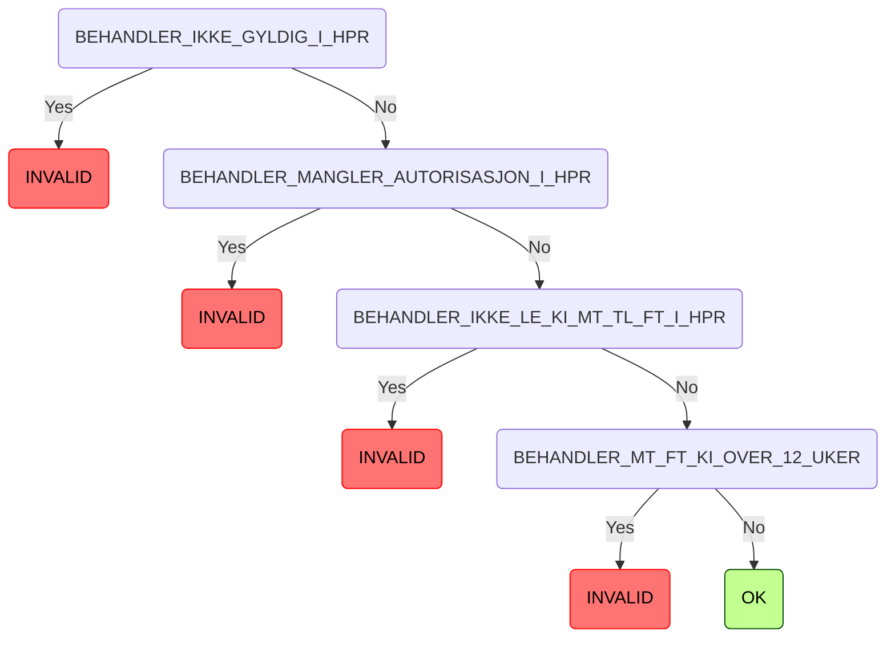

[](https://github.com/navikt/syfosmregler/workflows/Deploy%20to%20dev%20and%20prod/badge.svg)

# SYFO sykemelding regler
This project contains just the rules for validating whether a user is supposed to get paid sick leave


# Technologies used
* Kotlin
* Ktor
* Gradle
* Kotest
* Jackson

#### Requirements

* JDK 17
* Docker

## FlowChart
This the high level flow for the application


## Getting started
### Getting github-package-registry packages NAV-IT
Some packages used in this repo is uploaded to the GitHub Package Registry which requires authentication. It can, for example, be solved like this in Gradle:
```
val githubUser: String by project
val githubPassword: String by project
repositories {
    maven {
        credentials {
            username = githubUser
            password = githubPassword
        }
        setUrl("https://maven.pkg.github.com/navikt/syfosm")
    }
}
```

`githubUser` and `githubPassword` can be put into a separate file `~/.gradle/gradle.properties` with the following content:

```                                                     
githubUser=x-access-token
githubPassword=[token]
```

Replace `[token]` with a personal access token with scope `read:packages`.
See githubs guide [creating-a-personal-access-token](https://docs.github.com/en/authentication/keeping-your-account-and-data-secure/creating-a-personal-access-token) on
how to create a personal access token.

Alternatively, the variables can be configured via environment variables:

* `ORG_GRADLE_PROJECT_githubUser`
* `ORG_GRADLE_PROJECT_githubPassword`

or the command line:

```
./gradlew -PgithubUser=x-access-token -PgithubPassword=[token]
```
#### Running locally
`./gradlew run`

### Building the application
#### Compile and package application
To build locally and run the integration tests you can simply run `./gradlew shadowJar` or on windows 
`gradlew.bat shadowJar`

#### Creating a docker image
Creating a docker image should be as simple as `docker build -t syfosmregler .`

#### Running a docker image
`docker run --rm -it -p 8080:8080 syfosmregler`


### Upgrading the gradle wrapper
Find the newest version of gradle here: https://gradle.org/releases/ Then run this command:

```./gradlew wrapper --gradle-version $gradleVersjon```

### Contact

This project is maintained by navikt/teamsykmelding

Questions and/or feature requests? Please create an [issue](https://github.com/navikt/syfosmregler/issues).

If you work in [@navikt](https://github.com/navikt) you can reach us at the Slack
channel [#team-sykmelding](https://nav-it.slack.com/archives/CMA3XV997).

# Tilbakedatering rule flow

<!-- TILBAKEDATERING_MARKER_START -->

<!-- TILBAKEDATERING_MARKER_END -->


# HPR rule flow
<!-- HPR_MARKER_START -->

<!-- HPR_MARKER_END -->


# Legesuspensjon rule flow
<!-- LEGESUSPENSJON_MARKER_START -->

<!-- LEGESUSPENSJON_MARKER_END -->